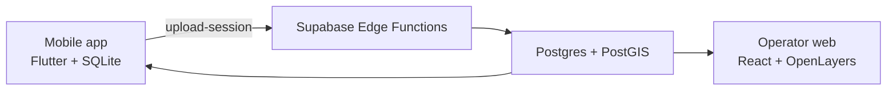

# SanDeVentura Architecture v3

## Architecture Principle

v3 architecture는 **trajectory-first, raw-transient, aggregate-only** 원칙을
따른다.

- Trajectory-first: route inference와 candidate discovery는 H3 cell이 아니라
  정제된 GPS trajectory로 판단한다.
- Raw-transient: raw GPS point는 upload 후 aggregation 단계에서만 사용하고
  처리 완료 후 폐기한다.
- Aggregate-only: operator와 mobile에는 representative geometry와 aggregate
  support metric만 제공한다.

---

## System Layout

### Mobile

- Offline GPS recording
- Active session recovery
- Upload queue and retry
- Canonical trail rendering
- snap-position guidance

### Backend

- PostgreSQL 15
- PostGIS
- Edge Functions on Deno
- pg_cron for scheduled aggregation

### Operator Web

- Route quality monitoring
- Session attribution review
- Candidate trajectory discovery
- Mountain bbox and route management

---

## Edge Functions

Current functions:

| Function | Purpose |
|---|---|
| `upload-session` | Validate uploaded GPS points and store accepted/rejected raw points temporarily |
| `match-and-aggregate-sessions` | Refine raw sessions, match route trajectories, create candidate trajectories, purge raw points |
| `promote-candidate-cluster` | Promote strongest candidate trajectory for a mountain into a route |
| `get-canonical-trail` | Return latest canonical trail geometry and metrics |
| `snap-position` | Compare current user position with route geometry |
| `get-mountains` | Return mountain and route list |

Removed functions:

- `recompute-canonical-trails`
- `evaluate-route-splits`

Canonical trail recomputation is now part of `match-and-aggregate-sessions`.
Branch/split automation is removed from the active architecture.

---

## Shared Algorithm Module

`web/supabase/functions/_shared/route_inference.ts`

Primary exports:

- `refineSessionTrajectory`
- `weightedDiscreteFrechetTrajectory`
- `mergeTrajectoryLines`
- `trajectoryLengthMeters`
- `trajectoryOverlapRatio`
- `buildTrajectorySegmentMetrics`

Key constants in current implementation:

- duplicate movement filter: 5m
- polyline simplification tolerance: 8m
- resampling interval: 20m
- route Frechet threshold: 45m
- route overlap threshold: 0.35
- route score margin threshold: 15m
- candidate Frechet threshold: 65m
- segment metric bucket: 100m

---

## Data Model

### Core Tables

| Table | Role |
|---|---|
| `mountains` | Mountain registry and bbox |
| `routes` | Route identity and display name |
| `hiking_sessions` | Uploaded session metadata and accepted/rejected counts |
| `track_points` | Temporary accepted raw GPS points |
| `rejected_track_points` | Temporary rejected raw GPS points and rejection reason |
| `canonical_trails` | Versioned representative route geometry |
| `candidate_trajectories` | Unmatched trajectory support waiting for operator review |
| `session_trajectory_attributions` | Session to route/candidate attribution summary |
| `trajectory_segment_metrics` | 100m directional timing/elevation aggregate |
| `session_route_assignments` | Session to route assignment diagnostics |

`track_points` and `rejected_track_points` are raw storage buffers, not durable
analytics tables. `purge_session_raw_points` removes them after aggregation.

### Legacy Tables Removed By v3 Migration

`0034_drop_legacy_h3_route_support.sql` removes:

- `trail_cells`
- `trail_cell_transitions`
- `candidate_cells`
- `candidate_cell_transitions`
- `route_to_candidate_transitions`
- `session_cell_attributions`
- `route_split_audit`

The old table names may still appear in older migrations because migrations are
append-only history. The active schema after migration 0034 is trajectory-based.

---

## Canonical Trail Model

`canonical_trails` keeps versioned geometry.

Important fields:

- `route_id`
- `version`
- `geom`
- `confidence`
- `confidence_level`
- `session_count`
- `branch_ambiguity_score`
- `gps_quality_score`
- `algorithm_version`
- `source_kind`

v3 source kinds:

- `trajectory_aggregate`: route updated from matched session trajectory
- `trajectory_candidate_promotion`: route created from candidate trajectory

---

## Candidate Model

`candidate_trajectories` stores representative unmatched geometry.

Important fields:

- `mountain_id`
- `geom`
- `point_count`
- `session_count`
- `contributing_sessions`
- `avg_accuracy`
- `avg_altitude`
- `length_m`
- `confidence`
- `latest_evidence_at`
- `algorithm_version`
- `status`

Candidate matching uses the same path-level metric family as route matching,
with a wider Frechet threshold than route matching.

---

## Segment Metrics

`trajectory_segment_metrics` stores aggregate 100m bucket metrics.

The key includes:

- mountain
- target kind
- target id
- algorithm version
- direction
- segment index

Direction is part of the key because uphill and downhill time/speed should not
be merged.

Metrics are calculated while raw point timestamps and altitudes are still
available.

---

## Operator Read Models

Important views/RPCs:

- `operator_session_ingestion`
- `operator_session_route_attribution`
- `operator_session_trajectory_attribution`
- `operator_candidate_trajectory_clusters`
- `operator_trajectory_segment_metrics`
- `candidate_trajectories_for_mountain`
- `route_trajectories_for_mountain`
- `route_quality_inputs`

Operator views must not expose raw coordinate payloads. Representative route
or candidate geometry can be shown, but per-session raw GPS paths should not be
shown.

---

## Privacy Boundary

Allowed to retain:

- route representative geometry
- candidate representative geometry
- session-level attribution counts
- aggregate timing/elevation metrics
- accepted/rejected point counts
- algorithm version

Not retained after aggregation:

- raw accepted track points
- rejected raw point payloads
- per-session refined trajectory coordinates

This preserves enough data for route quality and guidance while limiting long
term location retention.

---

## Scheduling

Active scheduled job:

- `match-and-aggregate-sessions`, every 15 minutes via pg_cron

Removed scheduled job:

- `evaluate-route-splits-hourly`

Operator can still trigger aggregation manually from the dashboard.

---

## Deployment Notes

Local development:

- Supabase local API: `http://127.0.0.1:54321`
- Supabase DB: `127.0.0.1:54322`
- Supabase Studio: `http://127.0.0.1:54323`
- Vite operator web: `http://localhost:5173`

Because v3 includes destructive cleanup of legacy H3 support tables, local reset
or migration testing should verify migration 0034 explicitly before deployment.

