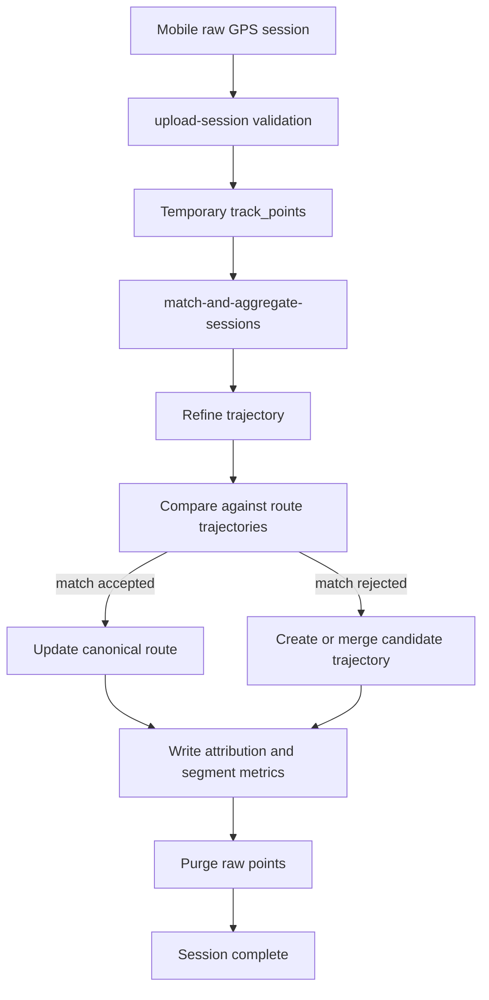
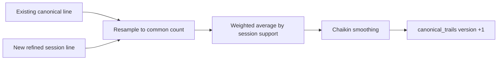

# Route Decision Process v3

이 문서는 사용자의 raw GPS session이 어떤 과정을 거쳐 canonical trail 또는
candidate trail이 되는지 설명한다. v3 기준 route decision은 H3 cell graph가
아니라 **refined trajectory와 path-level matching**으로 이루어진다.

---

## High-Level Flow



---

## 1. Upload And Raw Point Validation

Mobile uploads a session to `upload-session`.

Accepted points are stored in `track_points`. Rejected points are stored in
`rejected_track_points` with rejection reason. These raw tables are temporary
buffers and are not operator-facing read models.

Rejected point examples:

- missing timestamp
- invalid latitude or longitude
- missing or duplicate sequence index
- implausible speed
- low GPS accuracy

If at least one point is accepted, the session becomes `ingested`.

---

## 2. Trajectory Refinement

`match-and-aggregate-sessions` fetches unprocessed ingested sessions through
`unprocessed_ingested_sessions`.

`refineSessionTrajectory()` converts raw point sequence into a normalized path.

Steps:

1. Sort by `sequenceIndex`.
2. Drop near-duplicate movement below 5m.
3. Simplify polyline with 8m tolerance.
4. Resample to 20m spacing.
5. Preserve aggregate stats: point count, average accuracy, average altitude,
   latest evidence time, length.

The 20m resampling interval is not an H3 cell size. H3 is no longer part of
route inference. Resampling makes different sessions comparable as paths.

---

## 3. Route Matching

For the session trajectory, the backend loads latest route trajectories for the
same mountain using `route_trajectories_for_mountain`.

Each route is scored using `weightedDiscreteFrechetTrajectory()`.

Because hikers may traverse a route in either direction, the algorithm compares
both:

- session vs route path
- session vs reversed route path

The better score is used.

Route match is accepted only when:

| Condition | Default |
|---|---:|
| Frechet distance | <= 45m |
| Overlap ratio | >= 0.35 |
| Score margin vs next route | >= 15m |

If accepted:

- `session_route_assignments` receives route match diagnostics.
- `session_trajectory_attributions` records route attribution.
- `canonical_trails` gets a new version.
- `trajectory_segment_metrics` accumulates route segment metrics.

If rejected:

- the session is not absorbed into the nearest route.
- it becomes candidate trajectory evidence.

This is the main behavioral difference from the old H3 approach. Nearby route
distance alone is not enough to absorb a session.

---

## 4. Canonical Trail Update

When a session matches an existing route, the canonical geometry is updated by
merging the old representative line with the new refined trajectory.



The merge is weighted by existing session support so that one new session does
not overcorrect a route already supported by many sessions.

Confidence is currently calculated from:

- session support score: `min(1, sessionCount / 5)`
- GPS quality score: `1 - avgAccuracy / 100`

Current formula:

```text
confidence = sessionSupportScore * 0.35 + gpsQualityScore * 0.65
```

Recommended threshold:

- `confidence >= 0.70`
- `sessionCount >= 5`

Otherwise the route remains `reference`.

---

## 5. Candidate Trajectory Creation

If route matching fails, the session is compared against existing candidate
trajectories for that mountain.

Candidate merge condition:

| Condition | Default |
|---|---:|
| Candidate Frechet distance | <= 65m |
| Overlap ratio | >= 0.35 |

If a candidate matches:

- its representative geometry is merged with the new trajectory.
- point count and session count are updated.
- contributing session id is recorded.
- average accuracy and altitude are weighted by point count.

If no candidate matches:

- a new `candidate_trajectories` row is created.

Candidate evidence appears in the Discovery page by mountain.

---

## 6. Candidate Promotion

Operator can promote a candidate trajectory into a route.

`promote-candidate-cluster` performs:

1. Choose strongest candidate for the mountain by point count.
2. Create a new `routes` row.
3. Insert `canonical_trails` version 1 from candidate geometry.
4. Convert matching `session_trajectory_attributions` from candidate to route.
5. Upsert `session_route_assignments`.
6. Move `trajectory_segment_metrics` from candidate target to route target.
7. Mark candidate as `promoted`.

This replaces the old candidate cell promotion flow.

---

## 7. Segment Metrics

While raw timestamps and altitude are still available, the session is split into
100m route-relative buckets.

Metric key:

- target kind: route or candidate
- target id
- algorithm version
- direction: forward or reverse
- segment index

Stored aggregate:

- session count
- sample count
- duration sum and observation count
- average speed
- elevation gain/loss
- abrupt altitude change count
- max absolute altitude delta
- latest evidence time

Direction matters because uphill and downhill time should not be averaged
together.

Abrupt altitude change is flagged when altitude delta is both large and steep
relative to segment distance. This helps diagnose bad altitude samples.

---

## 8. Raw Point Purge

After route/candidate attribution and segment metrics are written,
`purge_session_raw_points` deletes:

- accepted `track_points`
- `rejected_track_points`

The session remains as metadata and aggregate support.

This means:

- raw GPS is not retained long term.
- exact reprocessing with a future algorithm is not possible.
- algorithm version must be preserved on outputs.

---

## 9. Operator-Facing Evidence

Sessions page:

- processing state
- mountain
- route support count
- route point count
- candidate support count
- candidate point count
- trajectory attribution detail
- match diagnostics

Discovery page:

- candidate trajectory count
- total point count
- session contribution count
- latest evidence
- map preview of candidate and route geometries

Quality page:

- route confidence
- session support
- GPS quality
- accepted/rejected point counts

Routes page:

- canonical trail geometry
- route state
- directional segment metrics

---

## 10. Removed Decision Logic

The following v2 route decision components are no longer active:

- GPS to H3 conversion
- gridPathCells interpolation
- trail_cells accumulation
- candidate_cells accumulation
- transition graph route extraction
- 75m per-cell route absorption
- route_to_candidate transition branch signal
- route_split_detection
- evaluate-route-splits cron
- split_route_atomic

The new decision model is intentionally simpler:

```text
Does the whole path match a route?
  yes -> route evidence
  no  -> candidate trajectory evidence
```

Operator promotion is the controlled path from candidate to route.

