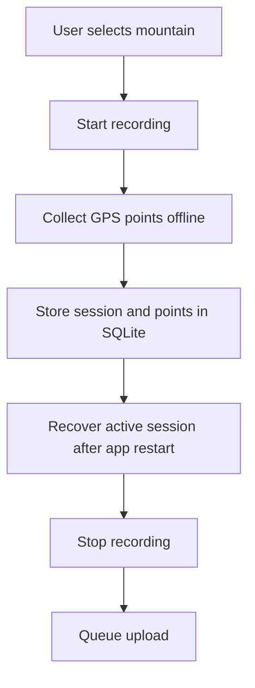
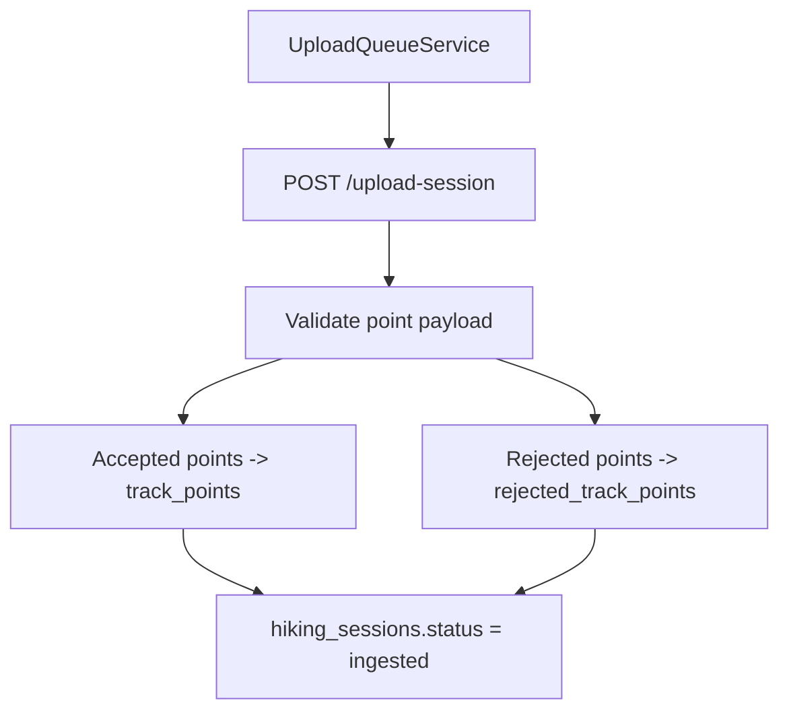
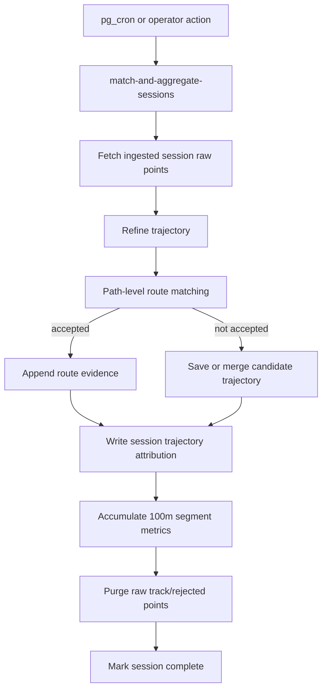
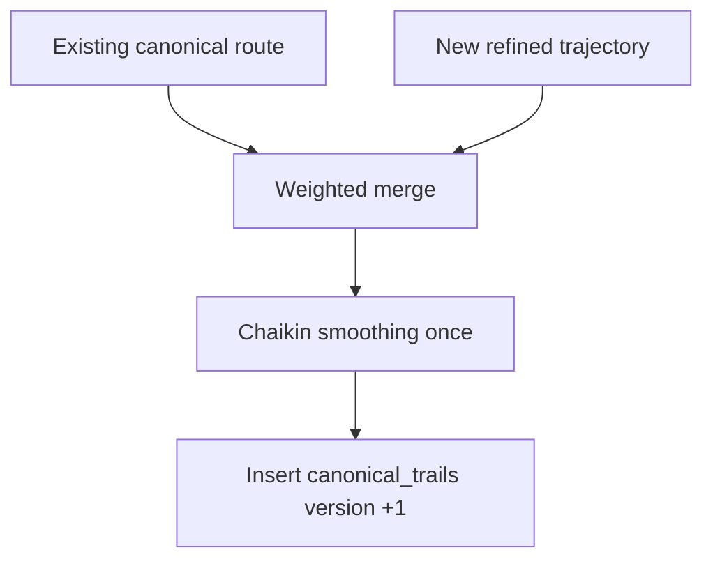
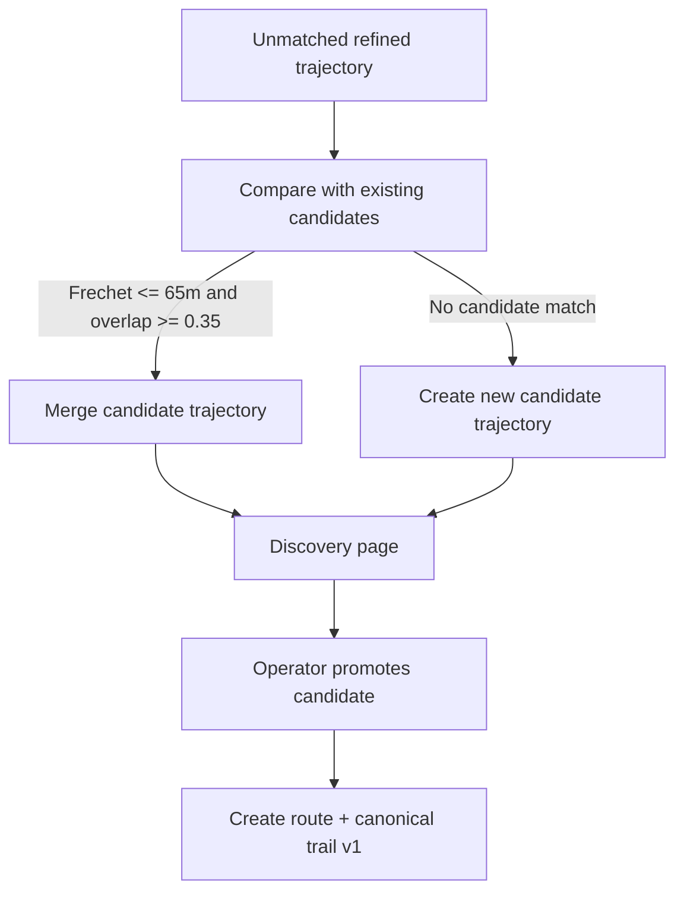
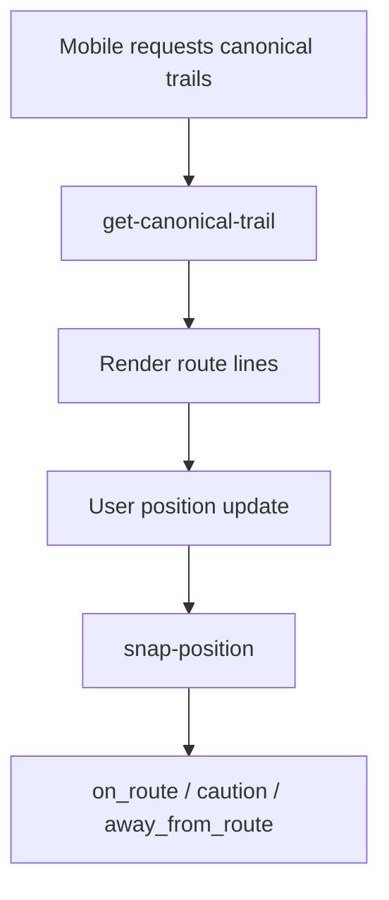

# SanDeVentura Workflow v3

## Overview

SanDeVentura의 핵심 workflow는 이제 **raw GPS를 H3 cell로 장기
누적하는 방식이 아니라, 업로드 직후 raw GPS를 정제한 trajectory로
계산하고 raw point를 폐기하는 방식**이다.

목표는 다음 세 가지다.

- 모바일은 오프라인 산행 기록을 안정적으로 수집한다.
- 백엔드는 raw GPS를 일시적으로만 사용해 canonical trail, candidate
  trajectory, segment metric을 만든다.
- 운영자는 raw 좌표가 아니라 대표 geometry와 aggregate support를 보고
  경로 품질을 진단한다.

---

## 1. Mobile Recording Workflow

Mobile app은 개별 route가 아니라 mountain을 선택해 기록을 시작한다.
사용자가 어느 route를 걸었는지는 서버가 나중에 판단한다.

수집되는 point:

- recorded time
- latitude / longitude
- altitude
- accuracy
- speed
- sequence index

로컬 SQLite는 네트워크가 없어도 기록을 유지하고, 앱 재시작 후 active
session을 복구한다.

---

## 2. Upload And Validation Workflow

`upload-session`은 point를 검증한 뒤 accepted/rejected count를 세션에
저장한다. raw point table은 직접 조회가 막혀 있으며, 이후
`match-and-aggregate-sessions`가 처리할 때만 사용된다.

주요 rejection:

- missing recordedAt
- invalid lat/lon
- missing or duplicate sequenceIndex
- implausible speed
- low accuracy

---

## 3. Trajectory Aggregation Workflow

정제 단계:

- sequence 순 정렬
- 5m 미만 중복 이동 제거
- 8m tolerance polyline simplification
- 20m 등간격 resampling

Route matching은 per-cell absorption이 아니라 전체 path 비교다.

기본 조건:

- route Frechet distance <= 45m
- overlap ratio >= 0.35
- score margin vs next route >= 15m
- reverse direction도 비교해 더 좋은 score를 사용

매칭 실패 시 session은 기존 route에 흡수되지 않고 candidate trajectory로
저장된다.

---

## 4. Canonical Trail Update Workflow

Route match가 accepted되면 기존 canonical trail과 새 refined trajectory를
같은 sample count로 resample한 뒤 weighted merge한다.

저장되는 값:

- route geometry
- confidence
- confidence level
- session count
- gps quality score
- algorithm version
- source kind

`canonical_trails`는 append-only version table이다. 최신 version이 모바일
route 안내와 operator map에 사용된다.

---

## 5. Candidate Discovery Workflow

Candidate는 H3 cell cluster가 아니라 representative trajectory다.
Discovery page는 mountain별 candidate trajectory count, total point
count, session contribution을 보여준다.

운영자가 candidate를 route로 승격하면:

- `routes` row 생성
- candidate geometry로 `canonical_trails` v1 생성
- candidate attribution을 route attribution으로 전환
- candidate segment metrics를 route metrics로 전환
- candidate status를 promoted로 변경

---

## 6. Segment Metric Workflow

Raw GPS가 아직 메모리에 있을 때 100m 구간 단위 metric을 계산한다.
계산 후에는 raw point를 폐기하므로, 시간/고도 분석에 필요한 aggregate는 이
단계에서 반드시 만들어야 한다.

저장 metric:

- direction: forward / reverse
- segment index
- duration sum / observation count
- average speed
- elevation gain / loss
- abrupt altitude change count
- max altitude delta
- latest evidence time

방향을 분리하는 이유는 같은 trail이라도 오르막/내리막 소요 시간이 다르기
때문이다.

---

## 7. Operator Monitoring Workflow

Operator web은 더 이상 H3 heatmap을 표시하지 않는다.

주요 화면:

- Overview: 전체 품질 요약
- Mountains: mountain bbox와 route coverage
- Routes: canonical trail geometry, confidence, segment metrics
- Sessions: session별 trajectory attribution, route/candidate support
- Quality: route confidence와 accepted/rejected point 기반 품질
- Discovery: candidate trajectory review와 route promotion

운영자는 raw GPS 좌표를 보지 않고 aggregate geometry와 support만 본다.

---

## 8. Mobile Guidance Workflow

`snap-position`은 현재 위치와 canonical trail의 거리를 PostGIS로 계산한다.
이 로직은 H3 cell inference와 독립적이며, trajectory 기반 canonical trail로
계속 동작한다.

---

## 9. Removed Workflows

v3에서 제거된 workflow:

- H3 cell hitmap generation
- trail_cells / candidate_cells accumulation
- trail_cell_transitions graph inference
- route_to_candidate_transitions branch signal
- evaluate-route-splits cron
- split_route_atomic RPC
- recompute-canonical-trails edge function
- comparison seed workflow

Route correction은 자동 split이 아니라 candidate trajectory review와
promotion 중심으로 단순화한다.

