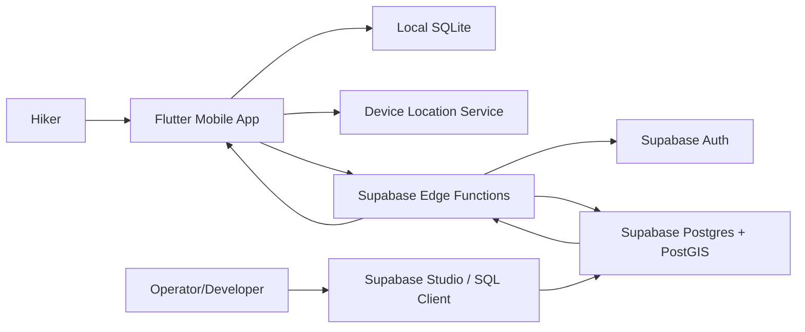
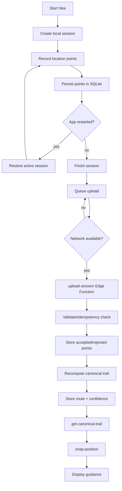
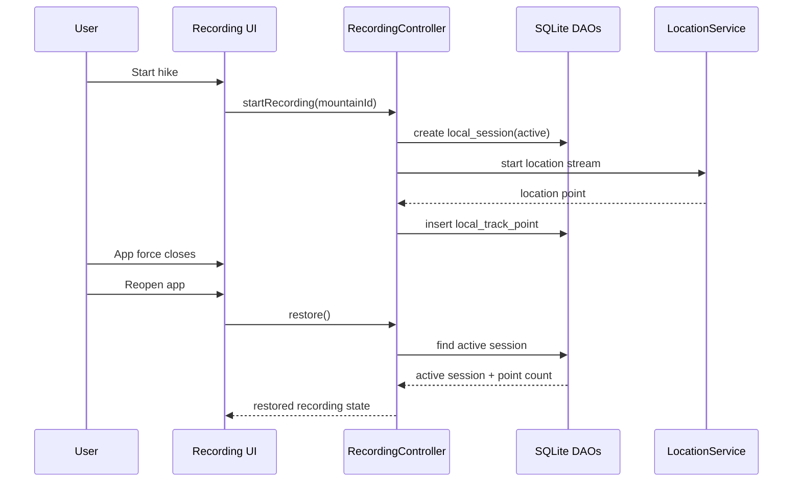
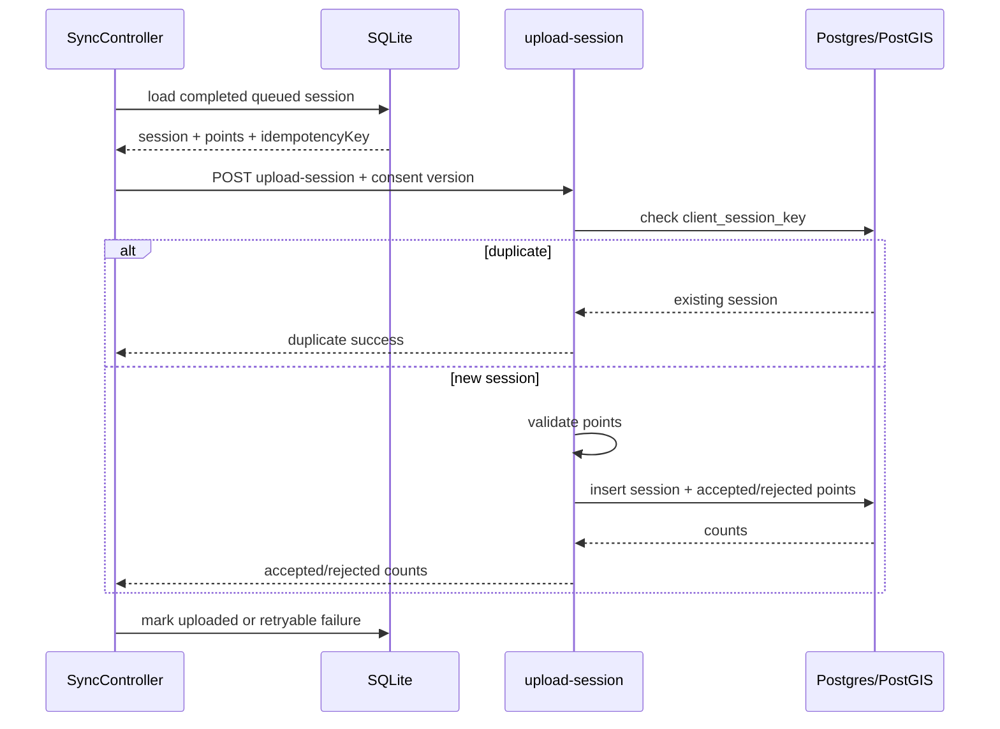
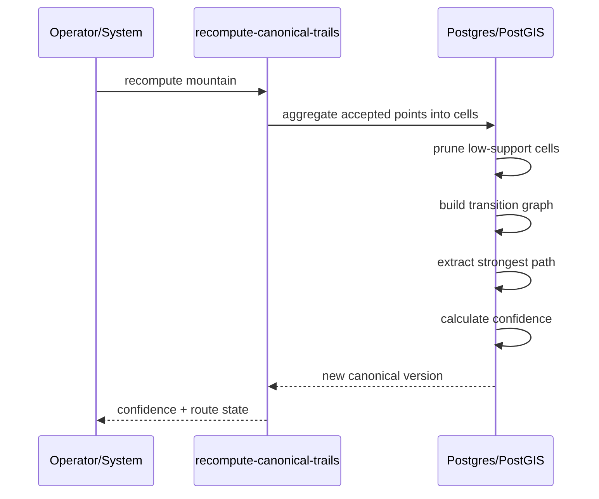
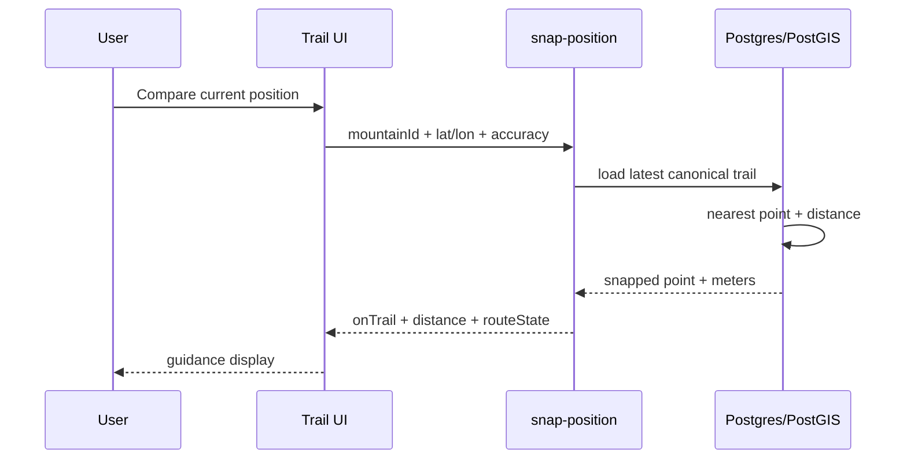
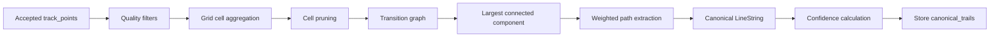

# Program Architecture: SanDeVentura MVP

**Status**: Draft  
**Date**: 2026-05-05  
**Related**: [spec.md](spec.md), [prd.md](prd.md), [plan.md](plan.md), [data-model.md](data-model.md), [contracts/api-contract.md](contracts/api-contract.md)

## 1. Architecture Goals

SanDeVentura MVP must prove one complete loop:

1. A hiker records a route without network access.
2. The app survives restart and preserves the active session.
3. A completed session uploads exactly once when connectivity returns.
4. The backend validates noisy GPS points and stores accepted spatial evidence.
5. Repeated traces create a confidence-labeled route where no base trail exists.
6. The user compares current position to that route and avoids wrong turns.

Architecture priorities:

- Offline-first mobile behavior.
- Local persistence before synchronization.
- Small backend surface.
- Inspectable geospatial processing.
- Confidence-first user guidance.
- Privacy-aware raw location handling.

## 2. System Context



### Boundary Decisions

- The mobile app owns active session continuity and offline queueing.
- Edge Functions own authenticated write-side validation and API response shaping.
- Postgres/PostGIS owns spatial persistence, indexes, route geometry, and nearest-route computation.
- The operator does not manually edit user sessions; operator tools inspect route quality and trigger recompute jobs.
- Hiker-facing APIs do not expose another user's raw sessions, raw track points, or identity.

## 3. Primary Use Cases

### UC-01 Record Offline Hike

**Actor**: Hiker  
**Trigger**: User taps start hike.  
**Result**: Local session and location points are persisted even without network.

Main flow:

1. User grants location permission.
2. App creates `local_sessions` row with `active` status.
3. Location stream emits points.
4. App validates minimal local shape and stores `local_track_points`.
5. UI shows recording status and point count.

Failure handling:

- If location permission is denied, no active session is created.
- If location service is disabled mid-session, session remains active but UI shows degraded recording state.
- If app closes, persisted session remains recoverable.

### UC-02 Restore Interrupted Session

**Actor**: Hiker  
**Trigger**: App launches after crash/force close.  
**Result**: Active session is restored or offered for recovery.

Main flow:

1. App startup queries `local_sessions` for active/paused session.
2. If one exists, recording state is restored.
3. New points append to the same session.
4. No duplicate active session is created.

### UC-03 Upload Completed Session

**Actor**: Hiker/system sync process  
**Trigger**: Completed local session exists and network is available.  
**Result**: Remote session is ingested once and accepted/rejected counts are returned.

Main flow:

1. App marks completed session as queued.
2. App confirms upload consent exists for the current consent version.
3. App sends session payload to `upload-session` with `idempotencyKey` and `uploadConsentVersion`.
4. Edge Function authenticates the user.
5. Edge Function rejects missing consent versions.
6. Edge Function checks existing `client_session_key`.
7. Edge Function validates points.
8. Accepted points are stored in `track_points`.
9. Rejected summaries are stored in `rejected_track_points`.
10. Response returns accepted/rejected counts and retention metadata.
11. App marks local session as uploaded.

### UC-04 Generate No-Base-Trail Reference Route

**Actor**: System/operator  
**Trigger**: Enough accepted points exist for a mountain; recompute job runs.  
**Result**: `canonical_trails` stores a reference or recommended LineString.

Main flow:

1. Load accepted `track_points` for `mountain_id`.
2. Aggregate points into grid cells.
3. Prune low-support and isolated cells.
4. Build session transition graph from ordered cell sequences.
5. Extract largest connected component.
6. Extract strongest path.
7. Calculate confidence inputs.
8. Store new `canonical_trails` version.

### UC-05 Compare Current Position to Route

**Actor**: Hiker  
**Trigger**: User opens guidance or requests current position comparison.  
**Result**: App receives nearest route point, distance, and on/off route judgment.

Main flow:

1. App sends `mountainId`, `lat`, `lon`, and `accuracy` to `snap-position`.
2. Edge Function loads latest canonical trail.
3. PostGIS computes nearest point and distance.
4. Function applies MVP thresholds: `<= 25m` is on route, `> 25m and <= 50m` is caution, and `> 50m` is away from route.
5. App displays route state and distance.

## 4. Data Flow

### End-to-End Flow



### Data Ownership

| Data | Owner | Persistence | Notes |
|------|-------|-------------|-------|
| Active session | Mobile app | SQLite | Must survive app restart |
| Raw recorded points | Mobile app | SQLite | Uploaded only after completion/sync |
| Upload idempotency key | Mobile app + backend | SQLite + Postgres | Prevents duplicate contribution |
| Accepted points | Backend | PostGIS | Used for route inference |
| Rejected point summary | Backend | Postgres | Used for quality debugging |
| Canonical trail | Backend | PostGIS LineString | Versioned per mountain |
| Confidence metrics | Backend | Postgres | Drives reference/recommended label |
| Current snap result | Edge Function | Ephemeral response | Not stored unless event logging requires summary |

### Privacy Ownership

| Rule | Owner | Verification |
|------|-------|--------------|
| Upload consent required before syncing completed location traces | Mobile + `upload-session` | Function test rejects missing consent version |
| No raw trace sharing between users | Postgres RLS + Edge Functions | RLS tests deny cross-user raw point/session reads |
| Event payloads avoid raw coordinate arrays | Edge Functions | Function tests inspect event payload shape |
| Rejected-point debug samples expire quickly | Database retention job | DB test verifies expiry metadata |

## 5. Module Architecture

### Mobile App Modules

```text
apps/mobile/lib/
├── app/
│   ├── app_shell.dart
│   └── dependency_injection.dart
├── features/recording/
│   ├── recording_screen.dart
│   ├── recording_controller.dart
│   ├── recording_state.dart
│   └── recording_use_cases.dart
├── features/sync/
│   ├── sync_controller.dart
│   ├── upload_queue_service.dart
│   └── upload_session_client.dart
├── features/trails/
│   ├── trail_guidance_screen.dart
│   ├── trail_guidance_controller.dart
│   ├── canonical_trail_client.dart
│   └── snap_position_client.dart
├── shared/db/
│   ├── app_database.dart
│   ├── session_dao.dart
│   ├── track_point_dao.dart
│   └── upload_queue_dao.dart
├── shared/location/
│   ├── location_service.dart
│   └── location_permission_service.dart
└── shared/domain/
    ├── entities.dart
    ├── result.dart
    └── geo_math.dart
```

Mobile dependency rule:

- UI depends on controllers.
- Controllers depend on use cases/services.
- Use cases depend on DAOs and API clients.
- DAOs own SQLite access.
- API clients own Supabase Edge Function calls.
- Location service is wrapped so it can be mocked in tests.

### Backend Modules

```text
supabase/
├── migrations/
│   ├── enable_extensions.sql
│   ├── schema_sessions_points.sql
│   ├── schema_trails_cells.sql
│   └── policies.sql
├── functions/
│   ├── _shared/
│   │   ├── auth.ts
│   │   ├── cors.ts
│   │   ├── response.ts
│   │   └── validation.ts
│   ├── upload-session/
│   │   └── index.ts
│   ├── get-canonical-trail/
│   │   └── index.ts
│   ├── snap-position/
│   │   └── index.ts
│   └── recompute-canonical-trails/
│       └── index.ts
└── tests/
    ├── db/
    └── functions/
```

Backend dependency rule:

- Edge Functions validate request/auth and call SQL/RPC.
- SQL owns durable writes, spatial functions, and constraints.
- Shared function code can normalize auth, errors, and response shape.
- Route inference SQL/procedure outputs debug-friendly intermediate tables.

## 6. Use Case to Module Mapping

| Use Case | Mobile Modules | Backend Modules | DB Tables |
|----------|----------------|-----------------|-----------|
| Record offline hike | recording, shared/location, shared/db | none | local_sessions, local_track_points |
| Restore interrupted session | recording, shared/db | none | local_sessions, local_track_points |
| Upload completed session | sync, shared/db | upload-session | hiking_sessions, track_points, rejected_track_points, mvp_events |
| Generate reference route | none/operator | recompute-canonical-trails | track_points, trail_cells, trail_cell_transitions, canonical_trails |
| Get canonical trail | trails | get-canonical-trail | canonical_trails |
| Compare current position | trails, shared/location | snap-position | canonical_trails, mvp_events |

## 7. Key Sequences

### Recording and Recovery



### Upload



### Route Recompute



### Position Comparison



## 8. Route Inference Architecture

### Processing Stages



### Route Quality Inputs

- `session_count`: how many distinct sessions support the route.
- `transition_consistency`: how consistently sessions move through the same cell edges.
- `gps_quality_score`: accuracy and rejection-rate signal.
- `branch_ambiguity_score`: penalty when multiple branches have similar support.
- `recency`: whether route evidence is recent enough for beta trust.

### Confidence Labels

| Confidence | Label | User Meaning |
|------------|-------|--------------|
| no route | 경로 없음 | No representative route is ready |
| `< 0.70` | 참고 경로 | Use cautiously; evidence exists but is not strong |
| `>= 0.70` | 추천 경로 | Repeated traces are consistent enough for guidance |

## 9. Error and Failure Modes

| Failure | User-facing behavior | System behavior |
|---------|----------------------|-----------------|
| Location permission denied | Explain blocker; do not create active session | No local session write |
| App killed during recording | Restore or offer recovery | Query active local session on startup |
| Network unavailable after finish | Show queued upload | Keep upload queue retryable |
| Duplicate upload | Treat as successful already uploaded | Idempotency key returns existing result |
| Too few points | Session stored but not route-contributing | Mark low support/rejected summary |
| No canonical route | Show 경로 없음 | Do not fabricate snap result |
| Ambiguous branches | Show 참고 경로 or lower confidence | Apply branch ambiguity penalty |
| Missing upload consent | Ask for consent before sync | Reject upload request |
| Snap distance 26m-50m | Show caution state | Do not mark clearly on/off route |

## 10. Testing Architecture

### Unit Test Targets

- Recording state transitions.
- Upload queue retry rules.
- Haversine distance and speed calculations.
- Confidence label mapping.
- Point filter pure functions.

### Integration Test Targets

- Offline recording to SQLite.
- App restart recovery.
- Upload against local Supabase.
- Duplicate upload replay.
- Canonical route retrieval.
- Snap-position response.

### Database Test Targets

- PostGIS geometry validity.
- Unique idempotency constraint.
- RLS baseline.
- Upload consent enforcement.
- Event payload privacy shape.
- Confidence threshold function.
- Route recompute intermediate outputs.

## 11. Implementation Stage Quote

> Current implementation stage: SDD and architecture planning are complete enough to start a fresh implementation. The old Flutter/Firebase prototype is discarded. The next executable step is monorepo creation, followed by Sprint 1: Flutter app setup, SQLite local session schema, foreground location recording, and app restart recovery.
